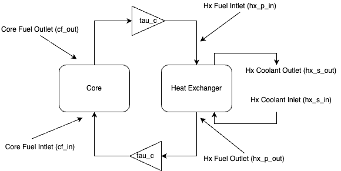
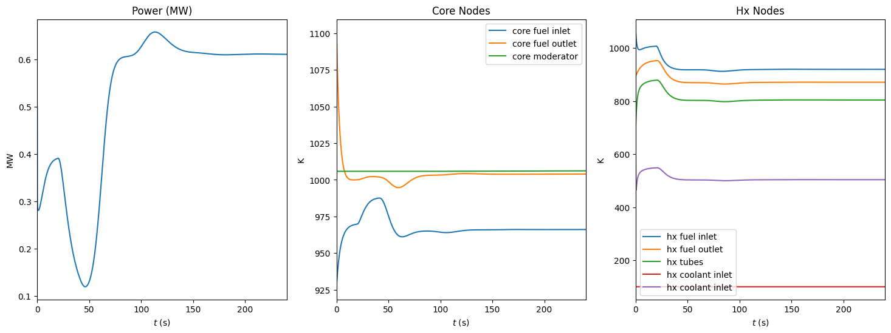
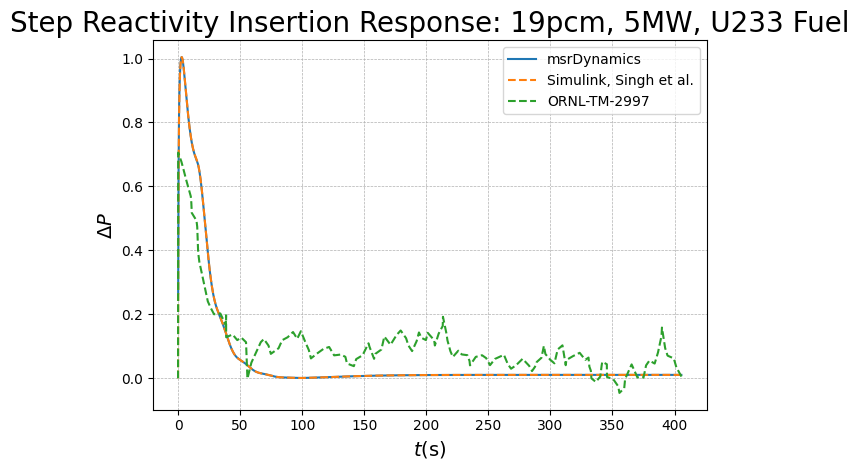

# msrDynamics

[](https://msrdynamics.readthedocs.io/en/latest/?badge=latest)

`msrDynamics` is an object-oriented API to [JiTCDDE](https://github.com/neurophysik/jitcdde), 
a delay differential equation solver, written with emulation of simulink-style solvers for
molten salt reactor (MSR) systems in mind (see [Singh et al](https://www.sciencedirect.com/science/article/pii/S030645491730381X)),
but can be extended to other fission and/or thermal hydraulic systems. The goal of this package is to streamline the implemetation of such nodal models for more complex systems, where direct handling of the equations can become cumbersome. 

## Installation

The project can be installed with pip from your preferred python environment. 

```
python -m pip install msrDynamics
```

If you plan on making changes to the source code, clone the repository, and install in developer mode. 

```
git clone https://github.com/LukeLabrie/msrDynamics.git
cd msrDynamics
python -m pip install -e .
```


## Methodology 

The API is designed for building nodal systems of the form discussed in the examples below, whereby variables representing system properties or masses are aggregated into nodes with associated properties, and which only interact with other nodes through these properties. The system can then be described as a first-order system of differential equations, suitable for a numerical solver. The nodes therefore, are essentially representations of the state variables of the system. 

For more detail on this approach and its applications, see:
- [Ball, 1963](https://digital.library.unt.edu/ark:/67531/metadc1201699/) 
- [Ball and Kerlin, 1965](https://www.osti.gov/biblio/4591881)
- [Kerlin, Ball and Steffy, 1971](http://moltensalt.org/references/static/downloads/pdf/ORNL-TM-2571.pdf)
- [Singh et al., 2017](https://doi.org/10.1016/j.anucene.2017.10.047)
- [Singh et al., 2018a](https://doi.org/10.1080/00295450.2017.1416879) 
- [Singh et al., 2018b](https://doi.org/10.1016/j.anucene.2017.10.047)
- [Singh et al., 2020](https://doi.org/10.1016/j.nucengdes.2019.110457)

## Usage

Nodes are represented by the `Node()` object which stores properties associated with the node, and contains helper methods to define certian dynamics like convective and advective heat transfer as well as neutron kinetics. For example, fuel flow through a core in direct contact with a moderator material (e.g. graphite), could be set up as follows. 

```python
import paramerers
import numpy as np

# instantiate system 
msr = System()

# define nodes with mass m, scpecific heat capacity scp, and mass flow W
f1 = Node(m = m_f1, scp = scp_f, W = W_f)
f2 = Node(m = m_f2, scp = scp_f, W = W_f)
g  = Node(m = m_g, scp = scp_g)

# add nodes to system 
msr.add_nodes([f1,f2,g])

# define dynamics 
f1.set_dTdt_advective(source = f_in)
f1.set_dTdt_convective(source = g.y(), hA = [hA_fg])

f2.set_dTdt_advective(source = f_1.y())
f2.set_dTdt_convective(source = g.y(), hA = [hA_fg])

g.set_dTdt_convective(source = [f1.y(), f2.y()], hA = [hA_fg, hA_fg])

# solve 
T = np.arange(0,100,0.01)
msr.solve(T)
```

Note, for any system, a `System()` object is required for proper handling of the global indexing required for the [JiTCDDE](https://github.com/neurophysik/jitcdde) backend. **Nodes need to be added to the system object before dynamics are defined**. This is because certain global system information is required in order to index the variables properly for the backend. 

Nodes can also represent state variables associated with neutron kinetics, like neutron concentration $n(t)$ delayed neutorn precursor concentrations $C_i(t)$, and therefore does not need to be associated with a thermal mass. The helper methods take other nodes to which a given node is coupled, along with relevant system parameters, as arguments, and sets up the symbolic expressions representing the equations govenring the dynamics of the node. These symbolic expressions are the input to the [JiTCDDE](https://github.com/neurophysik/jitcdde) backend. Alternatively, if the user wishes to circumvent the helper methods, or would like to define other dynamics, a node's dynamics can be set directly with a user-defined symbolic expression through the `Node.dydt` attribute, e.g.

```python
# instantiate system 
f = System()

# define nodes
x = Node(m = m_x)
y = Node(m = m_y)

# add nodes to system
f.add_nodes([x,y])

# define dynamics 
x.dydt = x.y() - y.y()
y.dydt = - x.y() + y.y() 
```

Helper methods currently encompass the following effects:
- Point kinetics, including modified point kinetics for MSRs
- Convective heat transfer
- Advective heat transfer (mass flow)

## Simple Example

The diagram below describes a simple MSR system. The notebook for the example below can be found in 
[examples/toyModel.ipynb](./examples/toyModel.ipynb).



First, `Node` and `System` objects are instantiated, with relevant parameters to describe the state of the node. Note, the parameters for this example are mostly borrowed from the Aircraft Reactor Experiment (ARE), see [examples/are](./examples/are).

```python
from toyParameters import *
from jitcdde import t
import msrDynamics
import matplotlib.pyplot as plt

# MSR system        
MSR = System()

# core nodes
cf_in = Node(m = m_f_c/2, scp = scp_f, W = W_f, y0 = T0_c_f1)  # core fuel inlet
cf_out = Node(m = m_f_c/2, scp = scp_f, W = W_f, y0 = T0_c_f2) # core fuel outlet
cm = Node(m = m_m_c, scp = scp_m, y0 = T0_c_m)                 # core moderator

n = Node(y0 = n_frac0)     # fractional neutron density
C1 = Node(y0 = C0[0])      # precursor group 1
C2 = Node(y0 = C0[1])      # precursor group 2
C3 = Node(y0 = C0[2])      # precursor group 3
C4 = Node(y0 = C0[3])      # precursor group 4
C5 = Node(y0 = C0[4])      # precursor group 5
C6 = Node(y0 = C0[5])      # precursor group 6
rho = Node(y0 = 0.0)       # reactivity

# heat exchanger nodes 
hx_p_in = Node(m = m_f_hx, scp = scp_f, W = W_f, y0 = T0_hfh_f1)     # hx primary circuit inlet
hx_p_out = Node(m = m_f_hx, scp = scp_f, W = W_f, y0 = T0_hfh_f2)    # hx primary circuit outlet
hx_t = Node(m = m_t_hxfh, scp = scp_t, y0 = T0_hfh_t1)                   # hx tubes
hx_s_in = Node(m = m_h_hxfh, scp = scp_h, W = W_h_fh, y0 = T0_hfh_h1)  # hx secondary circuit inlet
hx_s_out = Node(m = m_h_hxfh, scp = scp_h, W = W_h_fh, y0 = T0_hfh_h2) # hx secondary circuit outlet
```

Nodes are added to the `System` object which takes care of instantiation and indexing for the 
JiTCDDE backend. 

```python
MSR.add_nodes([cf_in,cf_out,cm,n,C1,C2,C3,C4,C5,C6,rho,
              hx_p_in,hx_p_out,hx_t,hx_s_in,hx_s_out])
```

Once nodes are added to the `System` object, dynamics can be defined. Variables can be accessed
by calling their associated `y` function from JiTCDDE, i.e. `node_name.y()`. To access a variable at a previous time $t-tau$, simply provide the time as an argument, i.e. `node_name.y(t-tau)`. 
simply 

```python
# core
# core
cf_in.set_dTdt_advective(source = hx_p_out.y(t-tau_hx_c_f)) 
cf_in.set_dTdt_internal(source = n.y(), k = k_f1*P)
cf_in.set_dTdt_convective(source = [cm.y()], hA = [hA_ft_c/2])

cf_out.set_dTdt_advective(source = cf_in.y()) 
cf_out.set_dTdt_internal(source = n.y(), k = k_f2*P)
cf_out.set_dTdt_convective(source = [cm.y()], hA = [hA_ft_c/2])

cm.set_dTdt_internal(source = n.y(), k = k_m*P)
cm.set_dTdt_convective(source = [cf_in.y(), cf_out.y()], hA = [hA_mc_c/2]*2)

n.set_dndt(rho.y(), beta_t, Lam, lam, [C1.y(), C2.y(), C3.y(), C4.y(), C5.y(), C6.y()])
C1.set_dcdt(n.y(), beta[0], Lam, lam[0], tau_c, tau_l)
C2.set_dcdt(n.y(), beta[1], Lam, lam[1], tau_c, tau_l)
C3.set_dcdt(n.y(), beta[2], Lam, lam[2], tau_c, tau_l)
C4.set_dcdt(n.y(), beta[3], Lam, lam[3], tau_c, tau_l)
C5.set_dcdt(n.y(), beta[4], Lam, lam[4], tau_c, tau_l)
C6.set_dcdt(n.y(), beta[5], Lam, lam[5], tau_c, tau_l)
rho.set_drdt([cf_in.dydt(),cf_out.dydt(),cm.dydt()],[a_f/2,a_f/2,a_b])

# heat exchanger
hx_p_in.set_dTdt_advective(source = cf_out.y(t-tau_c_hx_f))
hx_p_in.set_dTdt_convective(source = [hx_t.y()], hA = [hA_ft_hx])

hx_p_out.set_dTdt_advective(source = hx_p_in.y())
hx_p_out.set_dTdt_convective(source = [hx_t.y()], hA = [hA_ft_hx])

hx_t.set_dTdt_convective(source = [hx_p_in.y(),hx_p_out.y(),hx_s_in.y(),hx_s_out.y()],
                              hA = [hA_ft_hx, hA_ft_hx, hA_ht_hx, hA_ht_hx])

hx_s_in.set_dTdt_advective(source = 50)
hx_s_in.set_dTdt_convective(source = [hx_t.y()], hA = [hA_ht_hx])

hx_s_out.set_dTdt_advective(source = hx_s_in.y())
hx_s_out.set_dTdt_convective(source = [hx_t.y()], hA = [hA_ht_hx])
```

Note, nodes can represent thermal masses as well as parameters related to point-kinetics. Now the system can be solved. 

```python
sol_jit = MSR.solve(T)
```

Results for the above system are shown below. 



Solutions can be accessed from the `y_out` attribute of the associated node. The snippet below is used for the plot above. 

```python
# P
axs[0].plot(T, [k*P for k in n.y_out])
axs[0].set_xlim(t0,tf)
axs[0].set_title("Power (MW)")
axs[0].set_xlabel(r"$t$ (s)")
axs[0].set_ylabel("MW")
```

## Other Examples

See the notebooks below for more detailed examples of usage, as well as comparison to experimental data.

- [Simple Reactor](./examples/toy_reactor)
- [Aircraft Reactor Experiment](./examples/are)
- [Molten Salt Reactor Experiment](./examples/msre)

Comparison of results from the [Molten Salt Reactor Experiment](https://en.wikipedia.org/wiki/Molten-Salt_Reactor_Experiment) (MSRE) generated with `msrDynamics` against experimental data, and similar work by [Singh et al.](https://doi.org/10.1016/j.anucene.2017.10.047)
  