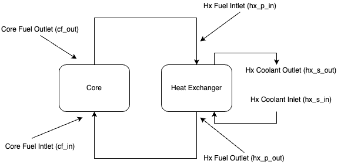
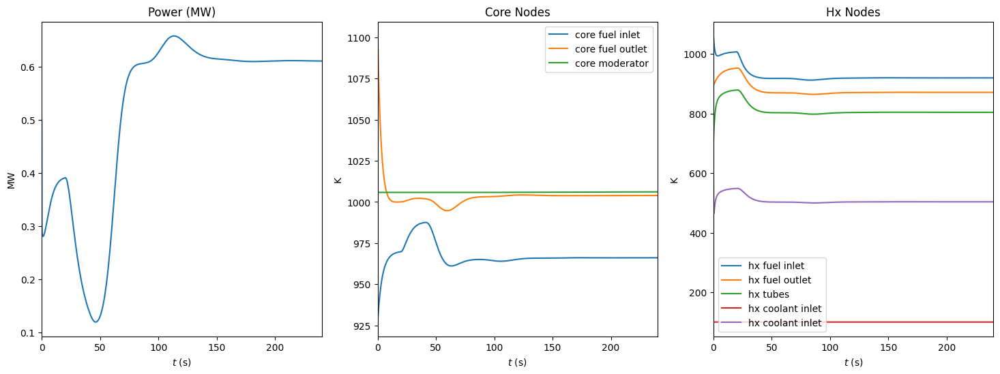

# msrDynamics

msrDynamics is an object-oriented API to [JiTCDDE](https://github.com/neurophysik/jitcdde), 
a delay differential equation solver, written with emulation of simulink-style solvers for
molten salt reactor (MSR) systems in mind (see [Singh et al](https://www.sciencedirect.com/science/article/pii/S030645491730381X)),
but can be extended to other fission, or thermal hydraulic systems. 

## Example

The diagram below describes a simple MSR system. The notebook for the example below can be found in 
[notebooks/toyModel.ipynb](./notebooks/toyModel.ipynb).



First, `Node` and `System` objects are instantiated, with relevant parameters to describe the state of the node. Note, the parameters for this example are mostly borrowed from the Aircraft Reactor Experiment (ARE) notebook, see [notebooks/ARE.ipynb](./notebooks/ARE.ipynb).

```python
from toyParameters import *
from msrDynamics.objects import Node, System
import matplotlib.pyplot as plt

# MSR system        
MSR = System()

# core nodes
cf_in = Node(m = m_f_c/2, scp = scp_f, W = W_f, y0 = T0_c_f1)  # core fuel inlet
cf_out = Node(m = m_f_c/2, scp = scp_f, W = W_f, y0 = T0_c_f2) # core fuel outlet
cm = Node(m = m_m_c, scp = scp_m, y0 = T0_c_m)                 # core moderator

n = Node(y0 = n_frac0)     # fractional neutron density
C1 = Node(y0 = C0[0])      # precursor group 1
C2 = Node(y0 = C0[1])      # precursor group 2
C3 = Node(y0 = C0[2])      # precursor group 3
C4 = Node(y0 = C0[3])      # precursor group 4
C5 = Node(y0 = C0[4])      # precursor group 5
C6 = Node(y0 = C0[5])      # precursor group 6
rho = Node(y0 = 0.0)       # reactivity

# heat exchanger nodes 
hx_p_in = Node(m = m_f_hx, scp = scp_f, W = W_f, y0 = T0_hfh_f1)     # hx primary circuit inlet
hx_p_out = Node(m = m_f_hx, scp = scp_f, W = W_f, y0 = T0_hfh_f2)    # hx primary circuit outlet
hx_t = Node(m = m_t_hxfh, scp = scp_t, y0 = T0_hfh_t1)                   # hx tubes
hx_s_in = Node(m = m_h_hxfh, scp = scp_h, W = W_h_fh, y0 = T0_hfh_h1)  # hx secondary circuit inlet
hx_s_out = Node(m = m_h_hxfh, scp = scp_h, W = W_h_fh, y0 = T0_hfh_h2) # hx secondary circuit outlet
```

Nodes are added to the `System` object which takes care of instantiation and indexing for the 
JiTCDDE backend. 

```python
MSR.addNodes([cf_in,cf_out,cm,n,C1,C2,C3,C4,C5,C6,rho,
              hx_p_in,hx_p_out,hx_t,hx_s_in,hx_s_out])
```

Once nodes are added to the `System` object, dynamics can be defined. Variables can be accessed
by calling their associated `y` function from JiTCDDE, i.e. `node_name.y()`. To access a variable at a previous time $t-tau$, simply provide the time as an argument, i.e. `node_name.y(t-tau)`. 
simply 

```python
# core
cf_in.set_dTdt_bulkFlow(source = hx_p_out.y(t-tau_c)) 
cf_in.set_dTdt_internal(source = n.y(), k = k_f1*P/mcp_f_c)
cf_in.set_dTdt_convective(source = [cm.y()], hA = [hA_ft_c/2])

cf_out.set_dTdt_bulkFlow(source = cf_in.y()) 
cf_out.set_dTdt_internal(source = n.y(), k = k_f2*P/mcp_f_c)
cf_out.set_dTdt_convective(source = [cm.y()], hA = [hA_ft_c/2])

cm.set_dTdt_internal(source = n.y(), k = k_m*P/mcp_m_c)
cm.set_dTdt_convective(source = [cf_in.y(), cf_out.y()], hA = [hA_mc_c]*2)

n.set_dndt(rho.y(), beta_t, Lam, lam, [C1.y(), C2.y(), C3.y(), C4.y(), C5.y(), C6.y()])
C1.set_dcdt(n.y(), beta[0], Lam, lam[0], tau_c, tau_l)
C2.set_dcdt(n.y(), beta[1], Lam, lam[1], tau_c, tau_l)
C3.set_dcdt(n.y(), beta[2], Lam, lam[2], tau_c, tau_l)
C4.set_dcdt(n.y(), beta[3], Lam, lam[3], tau_c, tau_l)
C5.set_dcdt(n.y(), beta[4], Lam, lam[4], tau_c, tau_l)
C6.set_dcdt(n.y(), beta[5], Lam, lam[5], tau_c, tau_l)
rho.set_drdt([cf_in.dydt(),cf_out.dydt(),cm.dydt()],[a_f/2,a_f/2,a_b])

# heat exchanger
hx_p_in.set_dTdt_bulkFlow(source = cf_out.y(t-tau_c))
hx_p_in.set_dTdt_convective(source = [hx_t.y()], hA = [hA_ft_hx])

hx_p_out.set_dTdt_bulkFlow(source = hx_p_in.y())
hx_p_out.set_dTdt_convective(source = [hx_t.y()], hA = [hA_ft_hx])

hx_t.set_dTdt_convective(source = [hx_p_in.y(),hx_p_out.y(),hx_s_in.y(),hx_s_out.y()],
                              hA = [hA_ft_hx, hA_ft_hx, hA_ht_hx, hA_ht_hx])

hx_s_in.set_dTdt_bulkFlow(source = 100)
hx_s_in.set_dTdt_convective(source = [hx_t.y()], hA = [hA_ht_hx])

hx_s_out.set_dTdt_bulkFlow(source = hx_s_in.y())
hx_s_out.set_dTdt_convective(source = [hx_t.y()], hA = [hA_ht_hx])
```

Note, nodes can represent thermal masses as well as parameters related to point-kinetics. Now the system can be solved. 

```python
sol_jit = MSR.solve(T)
```

Results for the above system are shown below. 



Solutions can be accessed from the `solution` attribute of the associated node. The snippet below is used for the plot above. 

```python
# P
axs[0].plot(T, [k*P for k in n.solution])
axs[0].set_xlim(t0,tf)
axs[0].set_title("Power (MW)")
axs[0].set_xlabel(r"$t$ (s)")
axs[0].set_ylabel("MW")
```