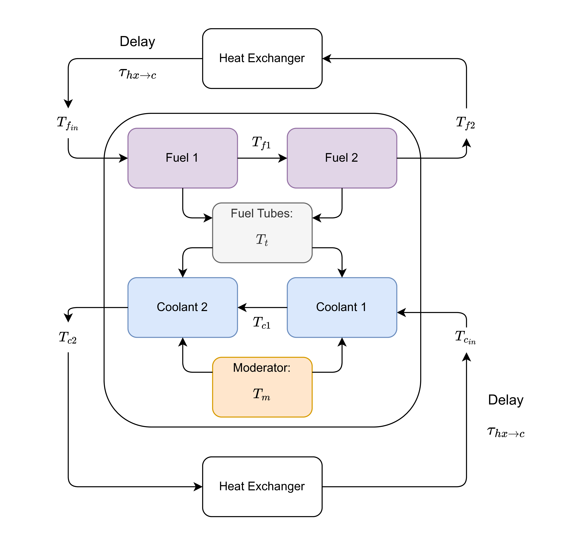

msrDynamics
=========================================

*Documentation Under Construction*

``msrDynamics`` is an object-oriented API for constructing and solving reduced order thermal hydraulic systems, written 
with emulation of Simulink-style solvers for molten salt reactor (MSR) systems in mind 
(e.g. `Singh et al <https://www.sciencedirect.com/science/article/pii/S030645491730381X>`_), but can be extended to 
other fission and/or thermal hydraulic systems. The goal of this package is to streamline the implementation of such 
nodal models for more complex systems, where direct handling of the equations can become cumbersome. 

Theory & Background
-------------------

The API is designed for building nodal systems where variables representing system components or masses are aggregated 
into nodes with associated properties, and which only interact with other nodes through these properties. The nodes 
therefore, are essentially representations of the state variables of a first-order system of differential equations, 
suitable for a numerical solver. 

A first-order system of ODEs (ordinary differential equations) takes the form

.. math::
   \dot{y} = f(t, y, \ldots)

For MSRs and other thermal hydraulic systems, the dynamics of the state at a given time, :math:`\dot{y(t)}`, depend on 
the state at time :math:`t`, :math:`y(t)`, but may also depend on the state at some previous time :math:`y(t-\tau)` 
where :math:`\tau = (\tau_1, \tau_2, ...)` are the respective delay times of the relevant state variables. The system to 
be solved is therefore a delay differential equation of the form 

.. math::

   \dot{y} = f(t, y(t), y(t-\tau_1), y(t-\tau_2), \ldots) 

``msrDynamics`` essentially provides tools to construct symbolic expressions representing a system of this form, which 
are then passed to `JiTCDDE <https://github.com/neurophysik/jitcdde>`_ as the backend solver. ``JiTCDDE`` integrates 
adaptively using a Bogacki-Shampine pair. The state and derivative of the system or stored at each integration step, 
which allows for past states to be evaluated using piece-wise cubic hermite interpolation. This is the DDE integration 
method proposed by Shampine and Thompson [ST01]_.

Modeling Approach
-----------------

The model essentially describes heat flow through the component masses, aggregating all spatial 
considerations into zero-dimensional (spatial) relationships governed by constant coefficients. Listed below is some relevant 
literature on this approach and its applications:

* `Ball, 1963 <https://digital.library.unt.edu/ark:/67531/metadc1201699/>`_
* `Ball and Kerlin, 1965 <https://www.osti.gov/biblio/4591881>`_
* `Kerlin, Ball and Steffy, 1971 <http://moltensalt.org/references/static/downloads/pdf/ORNL-TM-2571.pdf>`_
* `Singh et al., 2017 <https://doi.org/10.1016/j.anucene.2017.10.047>`_
* `Singh et al., 2018a <https://doi.org/10.1080/00295450.2017.1416879>`_
* `Singh et al., 2018b <https://doi.org/10.1016/j.anucene.2017.10.047>`_
* `Singh et al., 2020 <https://doi.org/10.1016/j.nucengdes.2019.110457>`_

The figure below shows an MSR core, modeled after that of the Aircraft Reactor Experiment `(ARE) <https://en.wikipedia.org/wiki/Aircraft_Reactor_Experiment>`_.
Each node is represented by its mass and thermophysical properties. 

The ARE core consisted of NaF-ZrF4-UF4 fuel which flowed through inconel tubes making several passes through BeO moderator blocks. A liquid sodium coolant flowed 
in the opposite direction, in direct contact with the moderator blocks and fuel tubes. The arrows in the figure above represent the heat flows considered in the model.
For example, there is advective heat flow between Fuel 1 and Fuel 2. Both are in contact with the tubes. As such there is convective heat exchange between the fuel
and the fuel tubes. 

Usage & API Description
-----------------------

The ``Node()`` object includes helper functions to define symbolic expressions representing convective and advective heat 
transfer, as well as generation from point-kinetics. User-defined dynamics are supported as well. The  ARE core (shown above) can be modelled as follows

.. code-block:: python

   from msrDynamics import Node, System 

   # instantiate system object
   ARE = System()

   # mass, kg
   m_fuel_core      = 100.0
   m_coolant_core   = 100.0
   m_tubes_core     = 100.0
   m_moderator_core = 350.0 

   # specific heat capacity MW/°K 
   scp_fuel      = 2.0e-3
   scp_coolant   = 4.0e-3
   scp_moderator = 2.0e-3
   scp_tubes     = 0.5e-3 

   # flow rate, kg/s
   W_fuel    = 100.0
   W_coolant = 50.0

   # convection heat transfer coefficients, MW/°K
   hA_fuel_tubes = 0.1
   hA_coolant_tubes = 0.4

   # delays 
   tau_c = 12.0
   tau_l = 16.0

   # inlet temperatures
   T_f_in = 650
   T_c_in = 500

   # power in MW & fraction of power generated in fuel nodes
   P = 2.0  
   P_f_1 = 0.5*P
   P_f_2 = 0.5*P

   # neutronics parameters
   Lam = 1.32e-04                                                                  # mean generation time (openmc ifp branch)
   lam = np.array([1.240E-02, 3.05E-02, 1.11E-01, 3.01E-01, 1.140E+00, 3.014E+00]) # precursor decay constants
   beta = (np.array([0.000223, 0.001457, 0.001307, 0.002628, 0.000766, 0.00023]))  # delayed precursor yield 
   beta_t = np.sum(beta)                                                           # total delayed neutron fraction
   # ARE
   beta_fracs = beta/beta_t
   beta_t = 0.0047 # ORNL-1845 pg. 150
   beta = np.array([beta_fracs[i]*beta_t for i in range(len(beta))])

   # initial conditions (analytical steady-state solutions)
   n_frac0 = 1.0      # initial fractional neutron density n/n0 (n/cm^3/s)
   rho_0 = beta_t-sum(np.divide(beta,1+np.divide(1-np.exp(-lam*tau_l),lam*tau_c))) # reactivity change in going from stationary to circulating fuel
   C0 = beta / Lam * (1.0 / (lam - (np.exp(-lam * tau_l) - 1.0) / tau_c))

   # define nodes
   n = Node(y0 = n_frac0)
   C1 = Node(y0 = C0[0])
   C2 = Node(y0 = C0[1])
   C3 = Node(y0 = C0[2])
   C4 = Node(y0 = C0[3])
   C5 = Node(y0 = C0[4])
   C6 = Node(y0 = C0[5])
   rho = Node(y0 = rho_0)
   fuel_1 = Node(m = m_fuel_core/2, scp = scp_fuel, W = W_fuel)
   fuel_2 = Node(m = m_fuel_core/2, scp = scp_fuel, W = W_fuel)
   fuel_tubes = Node(m = m_tubes_core, scp = scp_tubes)
   coolant_1 = Node(m = m_coolant_core/2, scp = scp_coolant, W = W_coolant)
   coolant_2 = Node(m = m_coolant_core/2, scp = scp_coolant, W = W_coolant)
   moderator = Node(m = m_moderator_core/2, scp = scp_moderator)

   # add nodes to system object
   ARE.add_nodes([n, C2, C2, C3, C4, C5, C6, rho, fuel_1, fuel_2, fuel_tubes, 
                  coolant_1, coolant_2, moderator])

   # define dynamics
   fuel_1.set_dTdt_advective(source = T_f_in)
   fuel_1.set_dTdt_convective(source = [fuel_tubes.y()], hA = [hA_fuel_tubes/2.0])
   fuel_1.set_dTdt_internal(source = [50.0], k = [P_f_1])
   fuel_2.set_dTdt_advective(source = fuel_1.y())
   fuel_2.set_dTdt_convective(source = [fuel_tubes.y()], hA = [hA_fuel_tubes/2.0])
   fuel_2.set_dTdt_internal(source = [50.0], k = [P_f_2])

   fuel_tubes.set_dTdt_convective(
                                  source = [fuel_1.y(), fuel_2.y(), coolant_1.y(), coolant_2.y()], 
                                  hA = [hA_fuel_tubes/2.0, hA_fuel_tubes/2.0, hA_coolant_tubes/2.0, hA_coolant_tubes/2.0]
                                  )

   coolant_1.set_dTdt_advective(source = T_c_in)
   coolant_1.set_dTdt_convective(source = [fuel_tubes.y()], hA = [hA_coolant_tubes/2.0])
   coolant_2.set_dTdt_advective(source = coolant_1.y())
   coolant_2.set_dTdt_convective(source = [fuel_tubes.y()], hA = [hA_coolant_tubes/2.0])

   # define time domain & solve
   minutes = 5.0
   T = np.arange(0.0, minutes*60.0, 0.01)
   sol = ARE.solve(T, populate_nodes = True)

Note, the `source` argument of `set_dTdt_advective()` can either be a constant float, or another state variable. 

Advanced Features
-----------------------

Inputs
^^^^^^^^^^^^^^^^
The ``jitcdde`` backend supports several representations of input. Users are referred to the 
`jitcdde documentation <https://jitcdde.readthedocs.io/en/stable/>`_ for more detail. An example file can be found 
`here <https://github.com/neurophysik/jitcdde/blob/master/examples/mackey_glass_parameter_jump.py>`_. ``jitcdde``-compatible representations of input
can be given as arguments to the helper functions of ``msrDynamics.Node``

Trip Conditions
^^^^^^^^^^^^^^^^
The user can impose operating limits on the state variables using ``msrDynamics.TripCondition``. When trip conditions are added to the 
system, integration will stop when the condition is reached, and the time at which the condition is reached will be estimated with a cubic 
interpolation of the anchor points closest to the trip time. 

PID Control 
^^^^^^^^^^^^^^^^
The ``msrDynamics.PID_loop`` class allows users to create objects which implement PID control logic compatible with the
``jitcdde`` backend. The object takes the PID control parameters, along with the state variable associated with the 
setpoint, and returns a callable function which can be used as an input variable in symbolic expressions, or in the 
``msrDyanamics.Node`` helper functions. The PID loop can be used to control the temperature of a node, for example, 
by setting the setpoint to the desired temperature, and the state variable to the temperature of the node. 
The PID loop will then return the control signal which can be used as an input to the node's dynamics.

Equilibrium Search
^^^^^^^^^^^^^^^^^^

API Reference
-------------

.. automodule:: msrDynamics
   :imported-members:
   :members:
   :undoc-members:
   :show-inheritance:

.. autoclass:: msrDynamics.Node
   :imported-members:
   :members:
   :undoc-members:
   :show-inheritance:

.. autoclass:: msrDynamics.System
   :imported-members:
   :members:
   :undoc-members:
   :show-inheritance:

.. autoclass:: msrDynamics.TripCondition
   :imported-members:
   :members:
   :undoc-members:
   :show-inheritance:

.. autoclass:: msrDynamics.PID_loop
   :imported-members:
   :members:
   :undoc-members:
   :show-inheritance:
